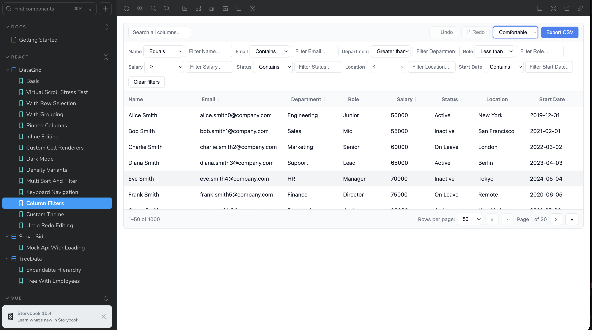
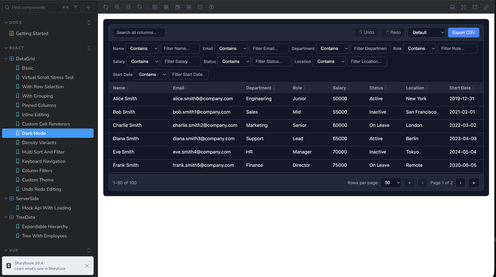
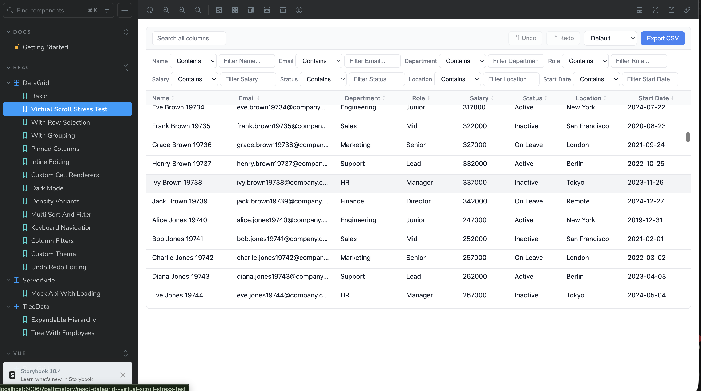
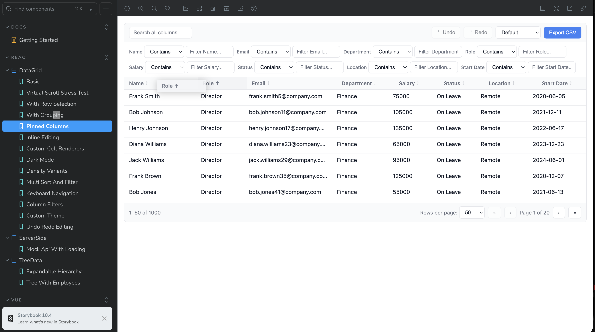
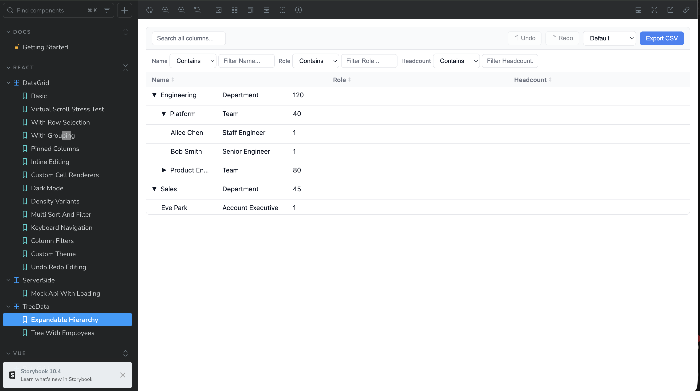
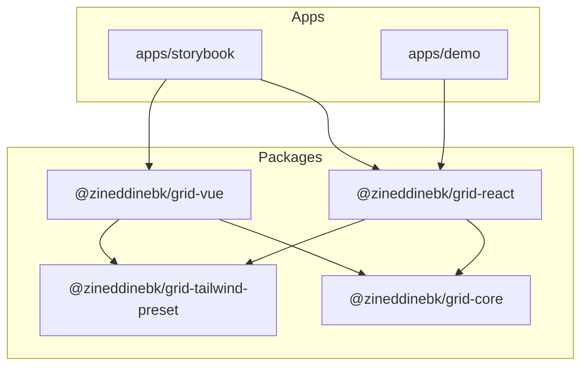

# Open-Source Data Grid Design System

A headless, enterprise-grade data grid component library for **React** and **Vue**, optimized for large datasets. Built with TypeScript, Zustand, Tailwind CSS, and Vite.

[](https://github.com/ZineddineBk09/Open-Source-Data-Grid-Design-System/actions/workflows/ci.yml)

**Live demo:** [GitHub Pages](https://zineddinebk.github.io/Open-Source-Data-Grid-Design-System/) · **Storybook:** [Component docs](https://zineddinebk.github.io/Open-Source-Data-Grid-Design-System/storybook/) · **Source:** [GitHub](https://github.com/ZineddineBk09/Open-Source-Data-Grid-Design-System)

## Screenshots

| Light mode + sort | Dark mode + selection |
|---|---|
|  |  |

| Column filters | Virtual scroll (100k rows) |
|---|---|
|  |  |

| Column pinning | Tree data |
|---|---|
|  |  |

## Why This Project

Publishing a shared design system demonstrates a commitment to **UI consistency**, **reducing duplicated work**, and writing **maintainable, performant code**. This grid handles the patterns found in intensive internal applications — virtual scrolling, multi-column sort, grouping, tree data, pinning, inline editing with undo/redo, server-side mode, and keyboard navigation — in a reusable, framework-agnostic architecture.

## Features

| Feature | Description |
|---------|-------------|
| Virtual scrolling | Render 100k+ rows smoothly via `@tanstack/virtual` |
| Column filters | Per-column operator dropdowns (contains, equals, gt/lt) |
| Sorting | Multi-column sort with stable comparators |
| Filtering | Per-column operators + global search |
| Grouping | Expandable group rows with nested hierarchy |
| Tree data | Expandable nested rows (`getSubRows`) |
| Column pinning | Sticky left/right columns with edge shadows |
| Column resize/reorder | Drag handles and header drag-and-drop |
| Row selection | Single/multi select, shift-click range |
| Inline editing | Double-click or Enter; undo/redo (Ctrl+Z) |
| Server-side mode | Manual pagination/sort/filter + loading overlay |
| CSV export | Export selected or all filtered rows |
| Theming API | Pass a `theme` object or CSS variables |
| Keyboard nav | Arrow keys, Space, Enter, Escape |
| Accessibility | ARIA grid roles, sort/selection indicators |
| Figma Code Connect | `DataGrid.figma.tsx` template for design parity |

## Architecture



**Headless core, styled adapters.** All grid behavior lives in `@zineddinebk/grid-core` (Zustand store + pure pipeline functions). React and Vue packages are thin bindings with DOM rendering and accessibility.

## Tech Stack

- **React 19** + **Vue 3** wrapper components
- **TypeScript** (strict mode)
- **Zustand** for sort/filter/selection state
- **Tailwind CSS 4** with shared design tokens
- **Vite 6** for fast bundling
- **Storybook 8** for component documentation
- **Vitest** + **Playwright** for unit and e2e tests
- **Changesets** for npm releases under `@zineddinebk/*`
- **pnpm + Turborepo** monorepo

## Quick Start

### Install (from npm, after publish)

```bash
pnpm add @zineddinebk/grid-react @zineddinebk/grid-tailwind-preset
```

### Local development

```bash
git clone https://github.com/ZineddineBk09/Open-Source-Data-Grid-Design-System.git
cd Open-Source-Data-Grid-Design-System
pnpm install
pnpm build
pnpm storybook
```

### React

```tsx
import { DataGrid } from '@zineddinebk/grid-react';
import '@zineddinebk/grid-react/styles.css';

const columns = [
  { id: 'name', accessorKey: 'name', header: 'Name', enableSorting: true },
  { id: 'email', accessorKey: 'email', header: 'Email' },
  { id: 'department', accessorKey: 'department', header: 'Department', enableGrouping: true },
];

<DataGrid
  data={employees}
  columns={columns}
  getRowId={(row) => row.id}
  enableRowSelection
  enableGlobalFilter
  showColumnFilters
  enableColumnResizing
  height={500}
  onCellEdit={(rowId, columnId, value) => updateCell(rowId, columnId, value)}
/>
```

### Vue

```vue
<script setup>
import { DataGrid } from '@zineddinebk/grid-vue';
import '@zineddinebk/grid-vue/styles.css';
</script>

<template>
  <DataGrid
    :data="employees"
    :columns="columns"
    :get-row-id="(row) => row.id"
    :enable-row-selection="true"
    :show-column-filters="true"
    :height="500"
    @cell-edit="handleCellEdit"
  />
</template>
```

## Bundle size

Run `pnpm bundle-size` after building. Approximate gzipped sizes (vs alternatives):

| Package | Gzip (KB) |
|---------|-----------|
| `@zineddinebk/grid-core` | 5.8 |
| `@zineddinebk/grid-react` | 6.9 |
| `@zineddinebk/grid-vue` | 5.5 |
| `@tanstack/react-table` (headless only) | ~14 |
| AG Grid Community (minimal) | ~180+ |

## Monorepo Structure

```
├── apps/
│   ├── storybook/       # Storybook docs + showcase stories
│   └── demo/            # Landing page + live demo (GitHub Pages)
├── packages/
│   ├── core/            # @zineddinebk/grid-core — headless engine
│   ├── react/           # @zineddinebk/grid-react — React components
│   ├── vue/             # @zineddinebk/grid-vue — Vue components
│   └── tailwind-preset/ # @zineddinebk/grid-tailwind-preset — design tokens
├── e2e/                 # Playwright tests
└── scripts/             # bundle-size, screenshot guide
```

## Scripts

| Command | Description |
|---------|-------------|
| `pnpm build` | Build all packages |
| `pnpm dev` | Watch mode for all packages |
| `pnpm storybook` | Launch Storybook on `:6006` |
| `pnpm test` | Run Vitest tests |
| `pnpm e2e` | Run Playwright e2e against demo |
| `pnpm typecheck` | TypeScript check across monorepo |
| `pnpm bundle-size` | Gzipped size report |
| `pnpm lint` | ESLint all packages |

## Deploy to GitHub Pages

Push to `main` triggers `.github/workflows/deploy-demo.yml`, which builds the demo + Storybook and publishes to GitHub Pages.

**One-time repo setup:**

1. GitHub → **Settings** → **Pages** → Source: **GitHub Actions**
2. Push to `main` — first deploy may take 2–3 minutes
3. Live at `https://zineddinebk.github.io/Open-Source-Data-Grid-Design-System/`

See [DEPLOY.md](./DEPLOY.md) for full publish steps including git commands.

## Publishing to npm

Packages publish under `@zineddinebk/grid-*` via [Changesets](https://github.com/changesets/changesets). npm scopes must be **lowercase** (`@zineddinebk`), even though your GitHub username is `ZineddineBk09`.

```bash
pnpm changeset          # describe your change
pnpm version-packages   # bump versions
pnpm release            # build + publish (CI on main with NPM_TOKEN)
```

## Performance

The virtual scroll stress test story renders **100,000 rows** with smooth scrolling. The data pipeline (filter → group → sort → paginate) runs as pure functions in `@zineddinebk/grid-core`, keeping framework adapters lightweight.

## Contributing

See [CONTRIBUTING.md](CONTRIBUTING.md) for development setup and guidelines.

## License

[MIT](LICENSE)
